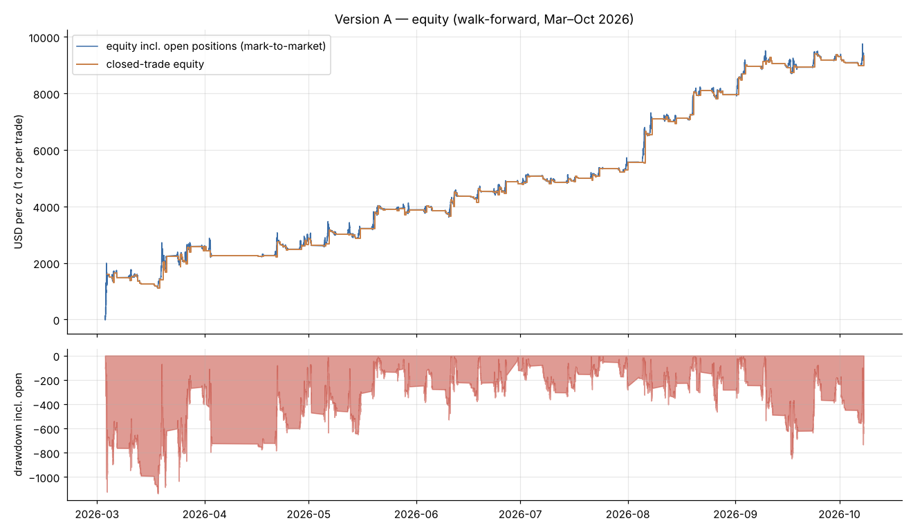
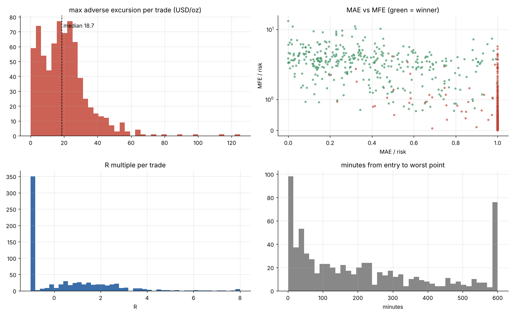
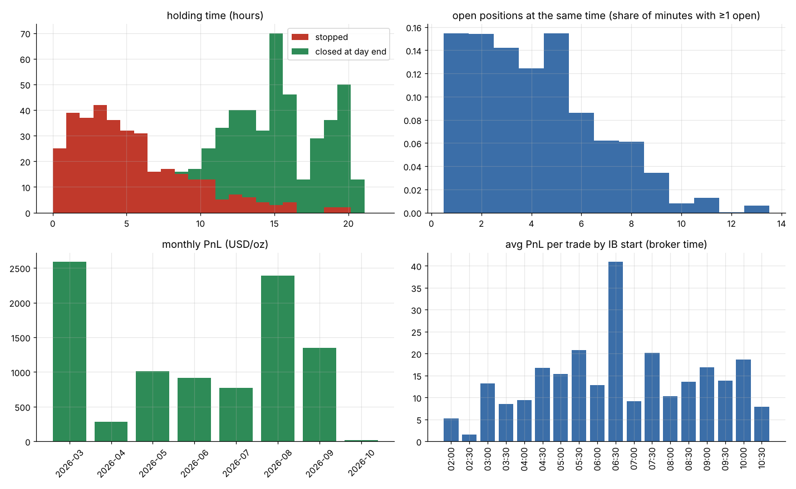
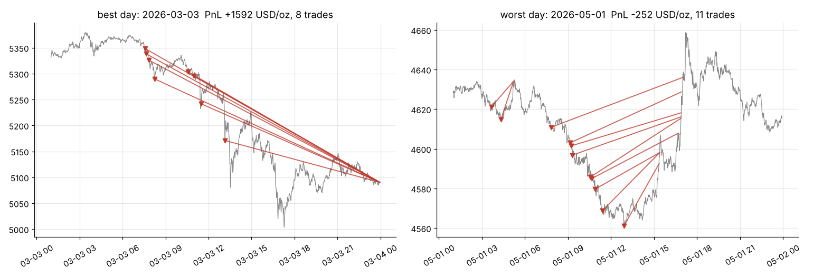

# XAUUSD IB 突破延續策略 — 定案版 A

> 資料：XAUUSD M1，2026/1/2 ~ 10/8（4/3~4/14 缺資料）。時間一律為 **broker 時間（= 紐約 + 7）**，交易日 = 01:00 ~ 23:59。
> 績效期間：**2026/3/3 ~ 10/7，滾動前推**（每月月初只用「之前」的資料重算門檻，等同實盤）。
> 金額單位：**美元/盎司 = 下 0.01 手的美元**；R = 損益 ÷ 進場時的停損距離。
> 重現：`python3 final_A.py`（明細 `final_A_trades.csv`、統計 `final_A_stats.txt`、門檻 `final_A_live.json`）。

---

## 1. 一句話
黃金在亞洲盤到倫敦盤（broker 02:00~11:00）每 30 分鐘建一個 60 分鐘的 Initial Balance，
**M5 收盤有效突破就順勢進場、IB 另一側停損、抱到當天收盤**；用 TPO 字母濾掉「剛發生 V 型反轉」與「順前日方向的小 IB」這兩種最容易失敗的突破。

---

## 2. 交易規則

### 2.1 參數
| 參數 | 值 |
|---|---|
| 交易日 | 星期二 ~ 星期五（**不做星期一**） |
| IB 起點 | 02:00、02:30、03:00 … 10:30（共 18 個，每 30 分一個） |
| IB 長度 | 60 分鐘（起點起算 60 根 M1 的最高 / 最低） |
| 突破有效時間 | IB 結束後 3 小時內 |
| 突破確認 | **M5 收盤** > IB 高 + 0.05 × ATR10（多）／ < IB 低 − 0.05 × ATR10（空） |
| 進場價 | 該根 M5 的收盤價（實盤：M5 收盤後市價進場） |
| 停損 | IB 另一側（多單 = IB 低、空單 = IB 高），掛單 |
| 出場 | 停損，或當天最後一根 K 棒（23:59 前）平倉；**沒有停利、不移動停損** |
| ATR10 | 前 10 個交易日「真實波幅」的平均（不含今天），目前約 80~110 美元 |

### 2.2 進場前檢查（任一成立就**不做**）
| # | 條件 | 目前門檻（`final_A_live.json`） |
|---|---|---|
| F1 | 突破方向 = 前一交易日（收 − 開）的方向，**且** IB 區間 < thr_ib × ATR10 | thr_ib = **0.127** |
| F2 | **反向尾巴** > thr_tail × ATR10 | thr_tail = **0.053** |
| F3 | **反向極值字母位置** > thr_ext | thr_ext = **0.82** |
| F4 | 同一根 M5、同一方向已經有一筆單（多個 IB 同時觸發只開一筆，保留最早的 IB） | — |

門檻每月月初用「到上月底為止的全部訊號」重算：thr_ib = IB/ATR 的 40% 分位、thr_tail = tail 的 90% 分位、thr_ext = ext_letter 的 90% 分位。
過去 8 個月門檻非常穩定（thr_ib 0.117~0.128、thr_tail 0.052~0.10、thr_ext 0.79~0.82）。

### 2.3 兩個 TPO 字母指標怎麼算
都用**當天 01:00 到進場前一刻**的 M1，切成 **15 分鐘一個字母**，價格格子 1 美元。
- **反向尾巴（tail）**：做多看剖面**最低**處、做空看**最高**處，從極端往內數「只有 1 個字母」的連續列數（美元），除以 ATR10。
  尾巴長 = 反方向剛有一根急速的針（單一字母就走完），代表 V 型反轉，突破容易失敗。
- **反向極值字母位置（ext_letter）**：做多看當天最低點、做空看最高點，是第幾個字母做出來的 ÷（目前字母數 − 1）。
  0 = 開盤第一個字母，1 = 最近的字母；> 0.82 代表反方向極值是剛剛才做出來的。

### 2.4 每日操作流程
1. 01:00 確認前一交易日方向（收 − 開）、ATR10、本月門檻。
2. 03:00 起每 30 分鐘：前一個 IB 收完 → 記下 IB 高 / 低。
3. 每根 M5 收盤時，檢查所有「3 小時內」的 IB 是否被有效突破。
4. 有突破 → 檢查 F1~F4 → 通過就市價進場、掛 IB 另一側停損。
5. 23:55 左右把所有未停損的單平倉。

---

## 3. 整體績效（滾動前推，2026/3/3 ~ 10/7，每筆 1 盎司）

| 項目 | 數值 |
|---|---|
| 交易筆數 | **735**（多 328 / 空 407） |
| 每個交易日平均筆數 | **6.1**（有交易的日子 6.4；120 天中 115 天有單） |
| 勝率 | 47.5% |
| 平均賺 / 平均賠 | +55.87 / −26.36（賺賠比 2.12） |
| **每筆期望** | **+12.69 美元/盎司（+0.46 R）**；中位數 −0.18 R |
| **PF** | **1.92** |
| 總損益 | +9,326 |
| 最大回撤（平倉後） | −545 |
| **最大回撤（含浮動，逐分鐘）** | **−1,136**（3/18） |
| 總損益 / 含浮動最大回撤 | 8.2 |
| 日 Sharpe（年化） | 4.62 |
| 正報酬日 | 48% |
| 最差單日 / 最好單日 | −252 / +1,592 |
| 最長連虧 / 連勝 | 21 筆 / 16 筆 |
| 獲利集中 | 最好 5 天占 50%；拿掉最好 10 天仍 +2,044 |

> 4/3~4/14 的水平線是資料缺口，不是沒交易。

---

## 4. 浮虧（風險）

### 4.1 單筆
| 項目 | 數值 |
|---|---|
| 單筆最大浮虧 | 125.0 美元/盎司（= 1.00 R，停損距離大的那筆；3/24） |
| 單筆浮虧 中位數 / 90% / 95% | 18.7 / 37.5 / 46.1 |
| 浮虧（R）中位數 | 0.91 R（一半的單會被打到接近停損） |
| **贏單**的浮虧中位數 | **0.34 R**（贏單通常只回撤三分之一個停損就走） |
| 浮虧最深點出現在進場後 | 中位數 167 分鐘 |
| 停損距離 | 中位數 26.3 美元（0.24 ATR），範圍 9.4 ~ 142.4 |
| 輸單中曾經浮盈 ≥ 1 R | 21% |
| 單筆最大浮盈 | 352.5（14.1 R） |

### 4.2 帳戶層級（同時持有的部位加總，逐分鐘、用 K 棒最差價）
| 項目 | 數值 |
|---|---|
| 同時持倉 最多 / 平均 | **13 筆** / 4.2 筆 |
| 帳戶同時浮虧最大 | −311.6 美元/盎司（3/24 14:01，持有 8 筆） |
| 含浮動最大回撤 | **−1,136**（平倉後只看得到 −545） |

### 4.3 換算成帳戶百分比（1 萬美元、每筆風險固定 r%、不複利）
| 每筆風險 | 總報酬 | 最大回撤（平倉） | **最大回撤（含浮動）** | 同時最大浮虧 |
|---|---|---|---|---|
| 0.25% | +85% | −4.0% | **−6.1%** | −1.0% |
| **0.5%（建議上限）** | +169% | −7.3% | **−10.9%** | −2.0% |
| 1.0% | +338% | −12.4% | **−18.0%** | −4.0% |

手數 = 帳戶 × r% ÷（停損距離 × 100）。例：1 萬美元、0.5%、停損 26 美元 → 50 ÷ 2,600 ≈ 0.02 手。明細 CSV 已附每筆的建議手數。

---

## 5. 持倉時間
| 項目 | 數值 |
|---|---|
| **平均持倉** | **10.8 小時**（中位數 12.0） |
| 停損單 | 平均 5.4 小時（中位數 4.5） |
| 收盤出場單 | 平均 15.6 小時 |
| 贏單 / 輸單 | 15.7 / 6.3 小時 |
| 出場比例 | 停損 47% / 收盤 53%（收盤出場的單 90% 賺錢，平均 +49.6） |

| 持倉時間 | 筆數 | 勝率 | 每筆 |
|---|---|---|---|
| 0 ~ 2 小時 | 70 | 0% | −22.5 |
| 2 ~ 8 小時 | 201 | 0% | −27.7 |
| 8 ~ 12 小時 | 97 | 40% | +1.0 |
| 12 ~ 16 小時 | 202 | 82% | +40.7 |
| 16 ~ 24 小時 | 165 | 87% | +49.5 |

→ **撐過 8 小時沒被停損的單，大多會賺**；前 8 小時被掃掉是常態。

---

## 6. 分組

**月份**
| 月 | 筆數 | 勝率 | 每筆 | 總計 | PF |
|---|---|---|---|---|---|
| 3 月 | 114 | 45% | +22.7 | +2,586 | 2.01 |
| 4 月 | 63 | 46% | +4.5 | +284 | 1.29 |
| 5 月 | 112 | 50% | +9.1 | +1,015 | 1.86 |
| 6 月 | 99 | 39% | +9.2 | +914 | 1.54 |
| 7 月 | 94 | 47% | +8.2 | +773 | 1.86 |
| 8 月 | 114 | 53% | +21.0 | +2,391 | 2.91 |
| 9 月 | 110 | 51% | +12.2 | +1,344 | 2.05 |
| 10 月（到 10/7） | 29 | 48% | +0.7 | +19 | 1.06 |

**星期**：二 PF 2.75、三 2.54、四 1.65、**五 1.07（最弱，觀察中）**。
**方向**：多 PF 1.94 / 空 1.90（兩邊一致）。
**IB 起點**：18 個起點全部為正；02:00 / 02:30 最弱（PF 1.34 / 1.08），05:30、06:30、07:30 最好。

**最好與最差的一天**（左：3/3 一路空到收盤 +1,592；右：5/1 連續做空 11 筆，紐約盤急拉全部停損 −252）

---

## 7. 開單明細欄位（`final_A_trades.csv`，735 筆）
| 欄位 | 說明 |
|---|---|
| 交易日、方向、IB起點、IB高、IB低 | 訊號來源 |
| 進場時間、進場價、停損價、停損距離 | 進場資訊（停損距離 = 1R） |
| 出場時間、出場價、出場原因 | 停損 / 收盤 |
| 損益_美元每盎司、損益_R | 已扣點差 |
| 最大浮虧、最大浮虧_R、最大浮虧出現_分鐘 | MAE |
| 最大浮盈、最大浮盈_R | MFE |
| 持倉_小時 | |
| ATR10、IB除ATR、順前日方向、反向尾巴_ATR、反向極值字母位置、點差 | 篩選用的特徵 |
| 1萬美元0.5%風險手數 | 建議手數 |

每月門檻：`final_A_thresholds_by_month.csv`。

---

## 8. 已驗證的事
- **沒有未來函數**：砍掉進場後的資料重算，訊號與特徵 0 筆不一致；延後一根 K 棒進場績效幾乎不變。
- **篩選不是運氣**：被 F1~F3 刪掉的 331 筆本身 PF 1.17、每筆 +2.3（幾乎不賺）；保留的單勝過 99.9% 的「隨機保留同樣多筆」。
- **參數穩定**：門檻每月重算幾乎不變；IB 長度 30~90 分、緩衝 0.02~0.05 ATR 都成立。
- **成本**：每筆多扣 0.5 / 1 / 2 美元滑價，PF 1.89 / 1.84 / 1.74。

## 9. 已知弱點與注意
1. **獲利靠趨勢日**：最好 5 天占一半獲利。盤整期會長時間小賠（最長連虧 21 筆）。
2. **同向疊單**：趨勢日最多同時 13 筆同方向；**含浮動的回撤是平倉回撤的 2 倍**，資金要以含浮動回撤來規劃。
3. **星期五、10 月偏弱**：目前樣本內 PF 1.07 / 1.06，列入監控，不先改規則。
4. **挑選偏誤**：版本 A 是從 144 組設定挑出，回測數字偏樂觀；**要用 10/8 之後的新資料原封不動地前推驗證**。
5. 實盤差異：M5 收盤到市價成交的滑價、停損跳空、點差放大（數據公布時）。

## 10. 監控與停用條件（建議）
- 每月：重算門檻、檢查當月 PF、勝率、平均持倉時間是否偏離（PF < 1 連續 2 個月 → 停下來檢查）。
- 含浮動回撤超過歷史最大（−1,136 美元/盎司 ≈ 0.5% 風險時 −11%）的 1.5 倍 → 暫停並重新評估。
- 前推驗證期間先用 0.25% 風險或模擬單。
