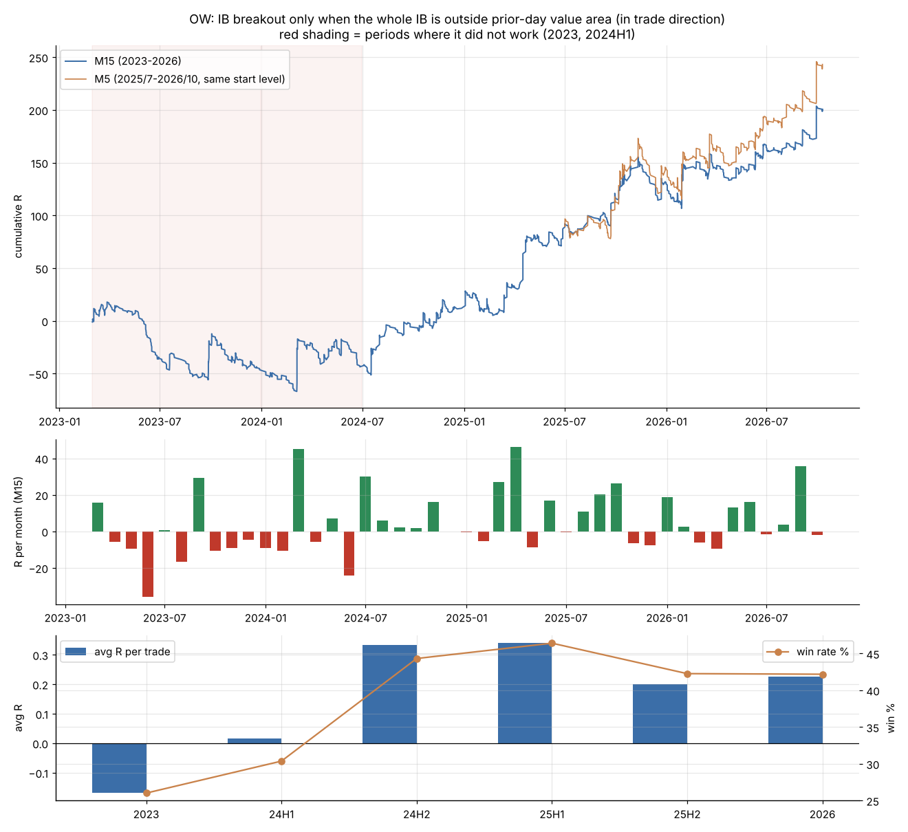
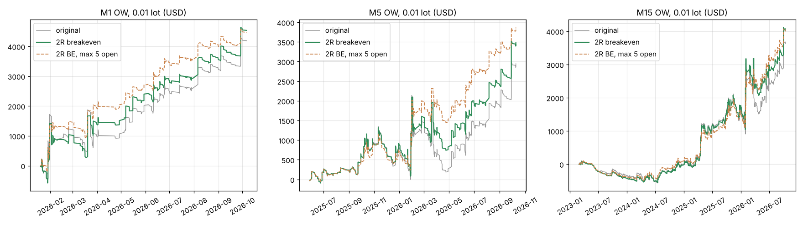

# XAUUSD IB 突破 — 「價值區外順勢」版（OW）

> 取代 `FINAL_STRATEGY_A.md`（版本 A 在 2023~2025 樣本外失效，見第二十二部分）。
> 資料：XAUUSD M15 2023/1~2026/10、M5 2025/5~2026/10；時間 = broker 時間（紐約 + 7）。
> 重現：`python3 part27_run.py && python3 part27_final.py`（結果 `results_part27.txt`、圖 `part27_ow.png`，逐筆 `part27_ow_M15.csv` / `part27_ow_M5.csv`）。

## 1. 規則
| 項目 | 設定 |
|---|---|
| IB | 02:00、02:30 … 10:30 起，各 60 分鐘的最高 / 最低（18 個） |
| 突破 | IB 結束後 3 小時內，K 棒收盤 > IB 高 + 0.05×ATR10（多）／ < IB 低 − 0.05×ATR10（空），以收盤價進場（實盤用 M5 收盤） |
| **唯一篩選** | **整個 IB 在前一天 TPO 價值區外、且在交易方向那一側**：做多要 IB 低 > 前日 VAH；做空要 IB 高 < 前日 VAL |
| 前一天價值區 | 前一交易日 30 分一個字母、1 美元一格、70% 價值區 |
| 停損 / 出場 | IB 另一側；沒停損就當天收盤（23:55 前）出場；不過夜 |
| **保本（第三十七部分加入）** | **浮盈（K 棒最高 / 最低點）≥ 2R 後，從下一根起停損移到進場價**；R = 進場到 IB 另一側的距離 |
| 其他 | 同一根 K 棒同方向只開一筆；星期一照做；不設停利 |

## 2. 績效（每筆 R；PF 以 R 計）
| 期間 | 每日筆數 | 勝率 | 每筆 | PF |
|---|---|---|---|---|
| 2023（3~12 月） | 1.3 | 26% | −0.17R | 0.77 |
| 2024 上半年 | 1.3 | 30% | +0.02R | 1.02 |
| 2024 下半年 | 1.3 | 44% | +0.33R | 1.62 |
| 2025 上半年 | 1.7 | 46% | +0.34R | 1.71 |
| 2025 下半年 | 1.6 | 42% | +0.20R | 1.36 |
| 2026（1~10 月） | 1.6 | 42% | +0.23R | 1.42 |
| **M5 精確版** 2025 下半年 / 2026 | 2.2 / 1.9 | 39% / 41% | +0.20R / +0.26R | 1.34 / 1.47 |

2024/7~2026/10 合計（M15）：915 筆、勝率 43.6%、每筆 +0.27R、PF 1.50、正報酬月 61%、最長連虧 35 筆、同時持倉最多 11 筆、平均持倉 9.9 小時；
每筆 0.25% 風險：+61%、最大回撤 −12%（平倉、不複利）。

## 3. 穩健性（M15，只改一個參數，2024 下半年起各期 PF）
IB 30 / 90 分、起點每 60 分、緩衝 0 / 0.1 ATR、時段 01~12 / 02~08 點、突破窗 2 / 5 小時、價值區 60% / 80%、「價值區外」改用 IB 中點或進場價 ——
**2024 下半年起全部 PF > 1（1.04~1.86）**，是一片高原。例外：「不做週一」在 2025 下半年 PF 0.42（再次證明不要加這條）。
最保守的變體是價值區 80%：六個期間每筆 R 都 ≥ +0.03（但每日只 0.8~1.4 筆）。

## 4. 已知限制
1. **在 2023、2024 上半年不賺**：當時黃金是區間輪動行情，價值區外的突破不延續。這個版本是在押「2024 年中起的趨勢行情持續」。
2. **看過全部期間才選出**：OW 是在第二十四部分看過 2023~2026 後才挑的，2024 下半年起的績效不是乾淨的樣本外。
3. **自動停用開關沒有用**：最近 50 / 100 / 150 筆 PF < 1 就暫停，每種都讓總報酬變少（+201R → +55~123R），也沒避開 2023。
4. **勝率中位數是 −1R**：一半以上的單會被停損，最長連虧 35~46 筆，要有心理與資金準備。
5. 出場：停利越近勝率越高但期望值越低（第二十六部分）；已採用「2R 保本」，讓浮盈曾 ≥ 2R 的單不再以虧損收場（見第 6 節）。

## 5. 建議用法
- 實盤建議用 M1 確認、每筆 0.01 手、最多同時 5 張（第三十四、三十七部分）。
- 每筆風險 0.25% 起（同時最多 11~13 筆同方向，等於最多約 3% 總風險）。
- 不加其他篩選、不做停利、不做週一以外的日曆篩選。
- 每季人工檢視：如果連續兩季每筆 R ≤ 0，視為行情回到 2023 型態，暫停並重新研究。

## 6. 加入「2R 保本」後的交易內容（第三十七部分，`part37_final_be.py` → `results_part37.txt`）
| | M1（2026/1~10） | M5（2025/5~2026/10） | M15（2023/3~2026/10） |
|---|---|---|---|
| 交易筆數 | 429 | 715 | 1,356 |
| 勝率 | 40.8% | 38.6% | 35.8% |
| 平均賺 / 平均賠 | +2.20R / −0.82R | +2.02R / −0.86R | +1.89R / −0.86R |
| 每筆（原規則） | +0.414R（+0.443） | +0.252R（+0.240） | +0.124R（+0.148） |
| PF（原規則） | 1.85（1.84） | 1.48（1.43） | 1.22（1.25） |
| 出場 停損 / 保本 / 收盤 | 47% / 8% / 45% | 51% / 6% / 43% | 53% / 7% / 40% |
| 浮盈曾 ≥ 2R 卻虧損（原規則） | **0**（20） | **0**（27） | **8**（58，跳空穿過） |
| 平均持倉 | 9.7h | 9.6h | 9.0h |
| 最長連虧（不含保本） | 17（15） | 46（30） | 45（33） |
| 0.01 手 最多 5 張：總美元 | **+4,470** | +3,868 | +4,055 |
| 平倉最大回撤 / 最差單日 | −556 / −389 | −935 / −375 | −881 / −490 |

M15 各期每筆 R：2023 −0.28、24H1 −0.00、24H2 +0.30、25H1 +0.33、25H2 +0.25、2026 +0.22（2023 年型態仍然不賺）。

